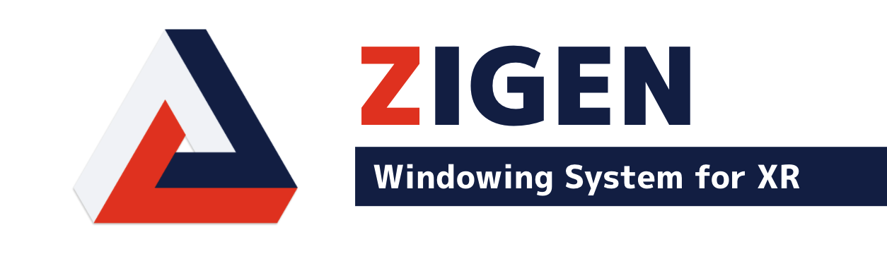

## My interests

**Tools that supports creative activities like engineering, designing, and so on**.

【 keywords 】
 - Developer Productivity
 - Continuous Integration and Delivery
 - Windowing System

## Stats

  
  

## My Projects

### zigen

**Windowing system for VR** (Adopted by [未踏IT人材発掘・育成事業](https://www.ipa.go.jp/jinzai/mitou/2021/gaiyou_sd-2.html))

  
  
  
  

### Google Summer of Code

